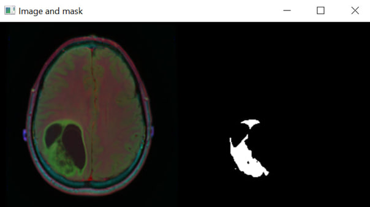
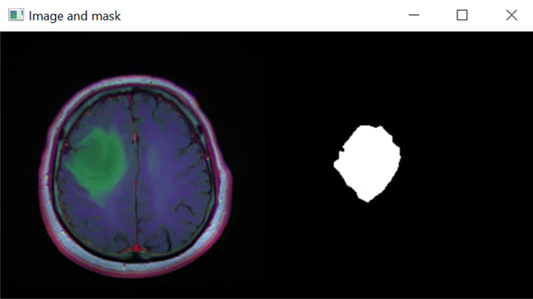
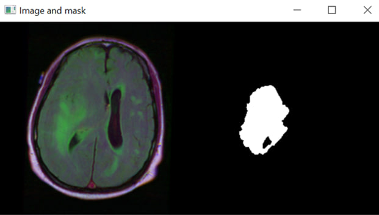
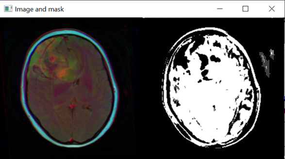
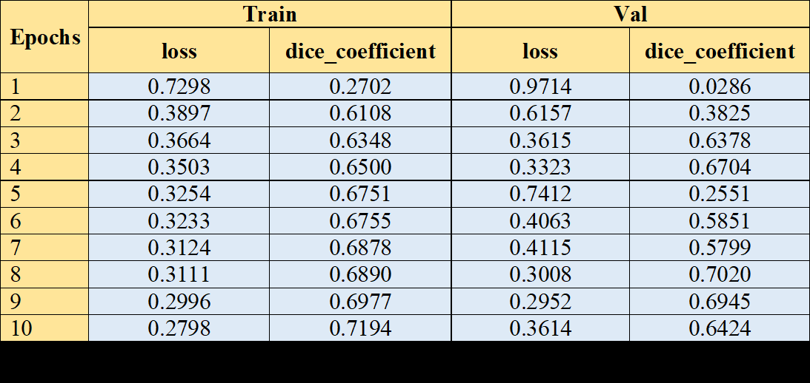

# Semantic segmentation combined with tabular data

## Project Overview
This project involves the integration of tabular data and segmented MRI images to predict patient mortality using a U-Net model for semantic segmentation and an XGBoost classifier for mortality prediction.

## Directory Structure
```
├── сolumns.py               # Definitions for columns (categorical/numerical, encoding, missing value handling)
├── model.plk                # Model file created during training
├── test_df.csv              # Test tabular data
├── train_df.csv             # Training tabular data
├── params_xgb.py            # Hyperparameters for training the XGBoost model
├── params.py                # Other parameters (image size, seed, etc.)
├── param_dict.pickle        # Encoding values and distribution boundaries for anomaly detection
├── README.md                # Instructions for installation and project execution
├── requirements.txt         # Dependencies file
├── predicted.csv            # Prediction results on test data
├── test_unet.py             # Test U-Net model on specific image (outputs MRI and mask pair)
├── train_unet.py            # Train and save the U-Net model
├── train_classifier.py      # Train the XGBoost model for mortality prediction
├── test_classifier.py       # Test the XGBoost model (predict mortality for each patient)
├── path.py                  # Paths and filenames needed for testing and training
├── unet_model_trained_new.h5 # Best U-Net model saved during training
├── tab_fea_test_df.csv      # Combined tabular data and feature map for test set
├── tab_fea_df.csv           # Combined tabular data and feature map for training set
├── mri_and_mask.py          # Paths to MRI images, masks, and patient IDs created during U-Net training
├── xgboost.plk              # Trained binary classification model for mortality prediction
```

## Installation

### Prerequisites
- Python 3.6 or higher
- pip (Python package installer)

### Install Dependencies
To install the necessary dependencies, run:
```bash
pip install -r requirements.txt
```

## Running the Project

### Step 1: Train the U-Net Model
To train with specific hyperparams you can change them in **params.py**
```bash
python train_unet.py
```

### Step 2: Test the U-Net Model
To test the U-Net model on a specific image and visualize the results:
```bash
python test_unet.py
```
You can test defined picture in **path.py**

### Step 3: Train the XGBoost Model
Ensure `tab_fea_df.csv` is created by combining tabular data and feature maps.
```bash
python train_classifier.py
```

### Step 4: Test the XGBoost Model
Ensure `tab_fea_test_df.csv` is created by combining tabular data and feature maps for the test set.
```bash
python test_classifier.py
```

## File Descriptions
- **Columns.py**: Contains definitions for columns, including how to handle categorical/numerical data, encoding, and missing values.
- **Model.plk**: The XGBoost model saved after training.
- **Test_df.csv**: Contains the test tabular data.
- **Train_df.csv**: Contains the training tabular data.
- **Params_xgb.py**: Defines hyperparameters for the XGBoost model.
- **Params.py**: Defines other parameters such as image size and random seed.
- **Param_dict.pickle**: Contains encoding values and boundaries for anomaly detection.
- **README.md**: This file.
- **requirements.txt**: Lists the project dependencies.
- **Predicted.csv**: Contains the prediction results on test data.
- **Test_unet.py**: Script for testing the U-Net model on a specific image.
- **Train_unet.py**: Script for training the U-Net model.
- **Train_classifier.py**: Script for training the XGBoost model for mortality prediction.
- **Test_classifier.py**: Script for testing the XGBoost model.
- **Path.py**: Contains paths and filenames required for testing and training.
- **Unet_model_trained_new.h5**: The best U-Net model saved during training.
- **Tab_fea_test_df.csv**: Contains combined tabular data and feature map for each patient in the test set.
- **Tab_fea_df.csv**: Contains combined tabular data and feature map for each patient in the training set.
- **Mri_and_mask.py**: Contains paths to MRI images, masks, and patient IDs created during U-Net training.
- **Xgboost.plk**: The trained binary classification model for mortality prediction.

## Notes
- Ensure the correct paths are set in `path.py` before running the scripts.
- Adjust parameters in `params.py` and `params_xgb.py` as necessary to fine-tune the model.

## Contact
For any questions or issues, please contact [kkaterynabilyk@gmail.com].

## RESULTS
### **U-NET**








### **XGBoost**:
- Cross-validated Accuracy: 0.41379310344827586
- Cross-validated Precision: 0.2902393500219587
- Cross-validated Recall: 0.9107142857142857
- Cross-validated F1 Score: 0.43942652329749105